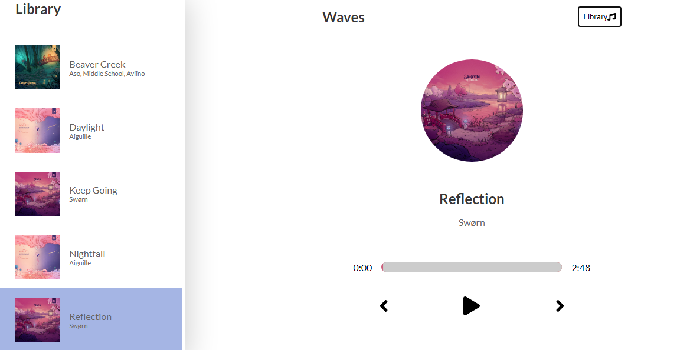

# Waves Music App

A fancy music player web app built with React and TypeScript.


# Built with

<p>
  <a href='https://www.react.org/'>
		
	</a>
  &nbsp;
  <a href='https://www.typescriptlang.org/'>
    
  </a>
  &nbsp;
   <a href='https://sass-lang.com/'>
    
  </a>
  &nbsp;
   <a href='https://fontawesome.com/'>
    
  </a>
</p>

# Tested with

<p>
  <a href='https://jestjs.io/'>
		
	</a>
  &nbsp;
  <a href='https://testing-library.com/'>
    
  </a>
  &nbsp;
</p>

## Screenshots




## Status

Currently: _finished_


# Development

## Available Scripts

- Clone the repo

  ```bash
  $ git clone https://github.com/francislagares/waves-music-app.git
  ```

- Install the dependencies by running the following command.

  ```bash
  yarn install
  ```

- Start the development server:

  ```bash
  yarn start
  ```

  Open [http://localhost:3000](http://localhost:3000) with your browser to see the
  result.


# Docker

- Building an image

  ```bash
  $ docker-compose build
  ```

- Running a container

  ```bash
  $ docker-compose up
  ```
  Open [http://localhost:3000](http://localhost:3000) with your browser to see the
  result.

- Stopping a container

  ```bash
  $ docker-compose down
  ```
# Author


Created by [@francislagares](https://www.linkedin.com/in/francislagares/) - feel free to contact me!
* 